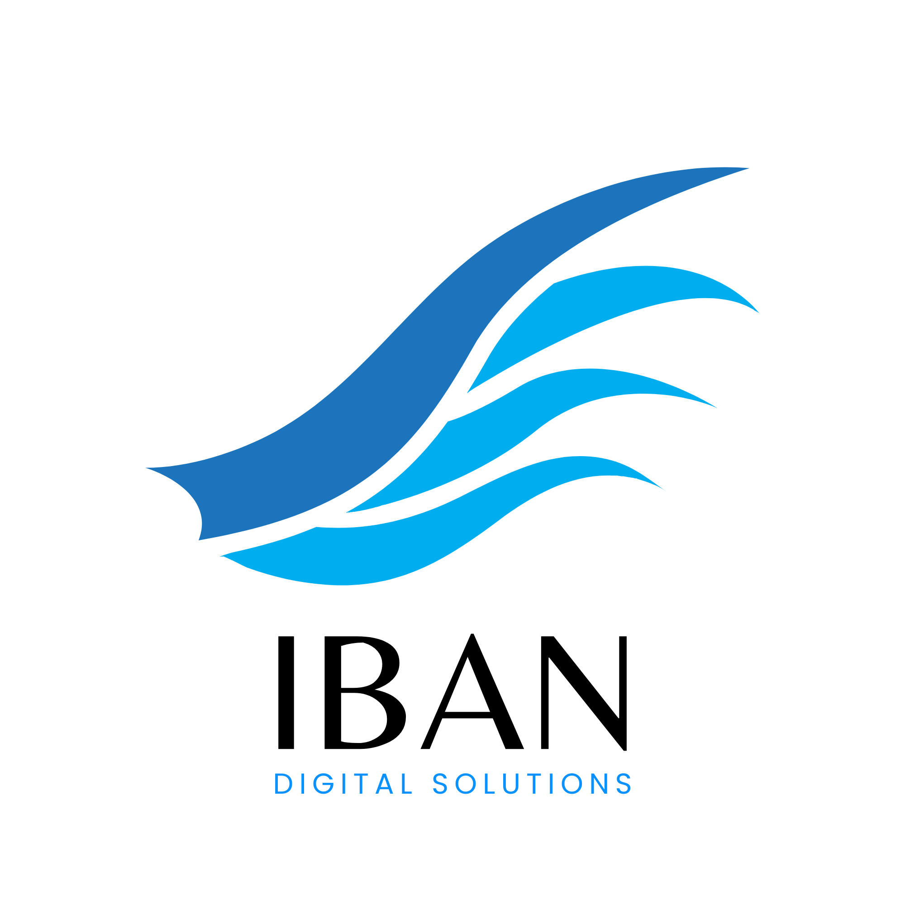

Welcome to the official repository of Iban Digital website, a premier digital marketing consulting company project designed to highlight our services and value propositions.

## Overview

Iban Digital website clearly explains what our company does and promotes our services. It’s designed to effectively communicate how we deliver value to potential clients, making it a vital tool for marketing and sales. This company was a venture I initiated with a group of friends. Although the project is currently on hold, it represents a significant effort in designing and developing a high-quality digital platform.

### Custom UI design by me

The user interface was completely designed by me to offer an intuitive and engaging user experience.

### Perfect SEO, accessibility and metatags integration

Achieves a perfect score of 100 in SEO, accessibility, performance, and best practices, ensuring top-notch quality and user satisfaction. It got ranked third on the first page of Google search results, showcasing its strong SEO and relevance.

#### Google ranking

#### Benchmark - Lighthouse results

#### Social Media Meta Tags (aka Open Graph)

## Tech Stack

- **Next.js 14:** Utilizes the latest version of Next.js, leveraging its powerful features for optimal performance and scalability.
- **Tailwind CSS:** Employs Tailwind CSS for fast and efficient styling, ensuring a consistent and modern design.
